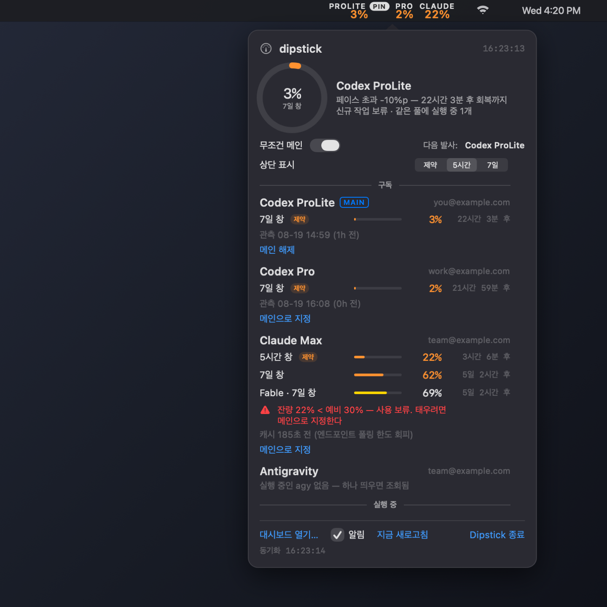

# dipstick

*[한국어 README](README_KOR.md)*

Which account should the next job burn? dipstick reads every AI coding
subscription on the machine and answers that — in a menu bar, on the command
line, and to your agents over MCP.

Claude Code, Codex and Antigravity each meter you on rolling windows, each shows
it somewhere different, and none of them answers the two questions that matter
before a long job: *which one has room, and if none does, when does it come
back?* Run more than one account and the second question turns into the first —
somebody has to pick the pool every launch rides, and doing it by feel means one
subscription runs dry while another idles. dipstick reads all three vendors in
one place and keeps a standing answer: `$(dipstick --main-cmd)` in front of any
command launches it on whichever account the numbers say should take it.

How that account is chosen is the actual product. **weighted** spends by *pace* —
not the raw percentage, but how far each pool sits ahead of an even burn toward
its reset, so a 40% the day before a reset outranks a 94% the hour after one.
**pinned** ignores the math and concentrates every launch on one subscription
until you say otherwise. Details in
[Pace, and how the launch target is chosen](#pace-and-how-the-launch-target-is-chosen).

**It runs on its own.** No orchestrator, no daemon, no packages — Orca and
friends are optional, and dipstick composes with them if you already run one
([With Orca](#with-orca-or-any-multi-account-wrapper)).



Three subscriptions across three accounts, read at once: two Codex plans and a
Claude Max, each with its own login. The bar carries one figure apiece; the
panel opens on click with every window, the pace surplus, the reserve floor and
which pool the next launch would ride.

**It never sends a prompt to a model.** Asking a model "how much do I have left"
would open a fresh rate-limit window — the opposite of what a gauge should do. So
every reading is either a passive file read or a metering endpoint that costs no
quota.

## What it reads

| Subscription | Source | Cost |
|---|---|---|
| Codex | `rate_limits` recorded in session rollout files | none — local files |
| Claude Code | `GET /api/oauth/usage`, the endpoint the CLI itself uses | none — metering only |
| Antigravity (`agy`) | `RetrieveUserQuotaSummary` on the running agent's local RPC | none — localhost |

Codex rollouts can run to several GB, so parses are cached by inode; after the
first run a refresh takes about a second.

## What you need

macOS 13+ and Python 3.9+ (the system one is fine). No packages, no daemon, no
orchestrator — dipstick reads whatever is installed and skips the rest:

| You use | dipstick reads | If absent |
|---|---|---|
| Claude Code | its OAuth usage endpoint (login keychain) | card simply not shown |
| Codex CLI | `~/.codex` session rollouts | 〃 |
| Antigravity | the running agent's local RPC | 〃 |

Any one of the three is enough.

## Several accounts of the same tool

Two subscriptions of the same vendor is the case dipstick is really for — one
gauge, both pools, and a launch that rides whichever has room. Neither CLI has a
profile switcher; both keep everything under a home directory named by an
environment variable, so a second account is a second directory.

**Codex** — `CODEX_HOME` holds the login, the config and the session rollouts:

```sh
mkdir -p ~/.codex-profiles/work/home
CODEX_HOME=~/.codex-profiles/work/home codex login     # log in as the other account
alias codex-work='CODEX_HOME=~/.codex-profiles/work/home codex'
```

**Claude Code** — `CLAUDE_CONFIG_DIR` does the same. The login does not live in
the directory but in the login keychain, under an entry named for it
(`Claude Code-credentials-<first 8 hex of sha256 of the absolute path>`), so
each config dir gets its own session rather than overwriting the last:

```sh
CLAUDE_CONFIG_DIR=~/.claude-work claude          # first run asks you to log in
alias claude-work='CLAUDE_CONFIG_DIR=~/.claude-work claude'
```

dipstick finds these on its own: `~/.codex`, `~/.codex-profiles/*/home` and
Orca-style `codex-accounts/*/home` for Codex, `~/.claude` and any sibling
`~/.claude-*` for Claude. A home kept somewhere else is named in the config
file, and nothing else changes:

```json
{ "claude_homes": ["~/work/claude-config"] }
```

Each account then shows as its own card with its own account line, and
`--main-cmd` names the home of whichever one it picked, so the launch rides that
account rather than the default one.

### With Orca (or any multi-account wrapper)

dipstick needs no orchestrator — but if you already run one, the two compose
cleanly because they hold opposite ends of the job: the wrapper owns *launching*
into many accounts, dipstick owns *metering* them.

Orca is the case it was built alongside. Orca keeps each
Codex account under its own home (`codex-accounts/*/home`) and its Claude login
in a managed keychain entry — dipstick reads both automatically, so every
account Orca can launch into shows up as a card with no configuration. In the
other direction, `$(dipstick --main-cmd)` drops into any command Orca (or a
plain shell) runs, so the wrapper launches into whichever account the gauge says
has room. Same shape for any other wrapper: point `claude_homes` or a
`~/.codex-profiles/*/home` symlink at wherever it keeps its accounts.

## Install

```sh
git clone https://github.com/blkpark/dipstick.git && cd dipstick
install -m 755 tools/dipstick ~/.local/bin/dipstick     # CLI
./scripts/bundle.sh && cp -R build/Dipstick.app /Applications/   # menu bar app
./scripts/install-login.sh    # optional: start at login (--remove to undo)
```

Reading the Claude figure needs its OAuth token, which lives in your login
keychain, so the first run raises a macOS access prompt. The token is used to
call Anthropic's own usage endpoint and is never stored or sent anywhere else.
When the token has expired, dipstick renews it through the same OAuth refresh
flow the CLI uses and writes the result back to the same keychain entry — the
whole entry, so nothing else stored in it is lost, and every reader picks up
the same token instead of racing over rotations. Only a reading that says
*logged out* needs you: `claude auth login` restores it.

## Use

```sh
dipstick                    # text report
dipstick --serve            # optional live web UI on 127.0.0.1:8787, click to set main
dipstick --html out.html    # self-contained page, no server
dipstick --json             # machine-readable snapshot
dipstick --set-main claude-max   # or any key from --json, or "auto"
dipstick --main-cmd         # launch prefix for whatever is main right now
dipstick --lang ko|en       # Korean or English (the web UI has a switch)
dipstick --statusline       # one line for a shell prompt or tmux bar
```

`--statusline` prints one line — per subscription, the window the menu bar
leads with, the main starred, colour only on LOW/BLOCKED, `%?` when the reading
is stale:

```
ProLite* 100% | Max 47% | Pro 97%
```

A run takes about a second (it refreshes the gauge), so wire it to something
that polls rather than something that blocks: `status-interval 15` in tmux, or
an async prompt segment. Piped output drops colour automatically (`--no-color`
forces it).

`--main-cmd` is the point of the "main" setting. Pick a subscription once, then
let your launch command ask which one to use instead of hardcoding it:

```sh
$(dipstick --main-cmd) "$(cat prompt.txt)"
# -> env CODEX_HOME="…/codex-accounts/…/home" codex "$(cat prompt.txt)"
```

## Alerts

The app posts a macOS notification when a subscription's constraining window
*crosses* into LOW/BLOCKED — and, the one people actually wait for, when it
recovers. Transitions only: launching into an already-low pool stays quiet, and
five polls of the same bad news produce one alert, not five. Toggle in the
panel footer; stale readings never trigger either edge.

## MCP — let your agent read the gauge

`mcp/dipstick-mcp` is an MCP stdio server over the same CLI, so any MCP-capable
agent (Claude Code, Codex, Cursor…) can ask before starting a long job:

```sh
install -m 755 mcp/dipstick-mcp ~/.local/bin/dipstick-mcp

# Claude Code
claude mcp add --scope user dipstick -- ~/.local/bin/dipstick-mcp

# Codex
codex mcp add dipstick -- ~/.local/bin/dipstick-mcp

# Antigravity (and other Gemini-family CLIs) — ~/.gemini/config/mcp_config.json:
#   { "mcpServers": { "dipstick": { "command": "~/.local/bin/dipstick-mcp", "args": [] } } }
```

Any other MCP-capable client registers the same way: a stdio server at
`~/.local/bin/dipstick-mcp`, no arguments, no environment.

Three tools, all read-only: `quota_status` (everything, with pace and reserve
state), `can_i_start(minutes, model?)` (GO / WAIT-with-recovery-time / NO_DATA —
never a downgrade suggestion; `model` narrows judgement to that model's scoped
windows plus the shared ones it drains), and `which_subscription` (what an anonymous launch would
ride — the name only, no command line). The tool descriptions carry the reading
discipline, so an agent quoting them inherits the pace/imminent/stale rules
instead of re-deriving them wrong. Launching stays with whatever tooling you
already trust; the server has no tool that acts.

## Tokens

The dashboard also shows what this machine actually spent, read from the same
local logs: tokens per hour in the current window, split into output, fresh
input and cache reads, with the cache hit rate.

Spend is broken out by model, because models do not drain a window at the same rate and a plan can carry a per-model cap of its own alongside the shared one.

That is also how the remaining figure is expressed, where it can be trusted at all: how much is left depends on what you run next, so the panel answers per model — what each one alone would spend to finish the window — and mixing lands somewhere between. The weights come from a non-negative fit of hourly drain against each model's spend, kept only when it explains the window (R² ≥ 0.7). Failing that, a single blended range needs R² ≥ 0.4. Failing both, the panel says so.

It stops short of a "tokens remaining" figure in most places, on purpose.
Neither vendor publishes how a window's capacity is spent, so the only honest
conversion is one fitted from finished windows — and dipstick measures how much
those windows disagree before quoting anything. Where they agree well enough the
figure appears as a range with that spread attached; where they don't, the panel
says so and points back at the percentage, which is exact. Measured here, 7-day
windows land near ±60% and five-hour windows near ±200%, so the short window
shows spend and no estimate.

The reason is visible in the numbers: cache reads are ~97% of the token count
and almost none of the limit, and their share moves from window to window.

## How it decides what's a problem

**Time-to-recovery, not the raw percentage.** 30% left on a 5-hour window and 30%
on a 7-day window are different problems: the first clears over lunch, the second
holds for days. Windows resetting within the hour are labelled *recovering* and
stop driving the verdict; whichever window actually constrains new work is
labelled *binds*.

Levels are `GO` (60%+), `TIGHT` (30–60%), `LOW` (under 30%) and `BLOCKED`. These
are starting points, not physics — a run's cost varies enormously by codebase and
task. dipstick records every reading, so once you have a day or two of history the
burn rate it shows is a better guide than the defaults.

## Config

Everything below is optional — `~/.config/dipstick/config.json`:

```json
{
  "reserve": { "Claude": 30 },
  "policy": {
    "Codex Pro": ["2nd", "when the smaller plan runs short"]
  },
  "imminent_minutes": 60
}
```

**`reserve`** keeps a percentage of a subscription for your own use. If you chat
with Claude on the same plan your agents run on, a floor stops background jobs
from eating the conversation you're having. Below the floor a subscription is held
back — unless you name it as main, which is an explicit override that burns
through it and says so on the page.

**`policy`** is your own note per subscription (a rank, a rule, whatever order you
work by). dipstick only displays it; it does not act on it.

## Pace, and how the launch target is chosen

Every reading also shows its **pace surplus**: how far it sits from where a
perfectly even spend would have it (`94% (+4)` — the window just reset, so 94%
is level pace, not headroom; 40% the day before a reset is plenty). Verdicts are
graded against this surplus, not against fixed percentages.

`--main-cmd` picks the subscription a new launch should burn, in one of two modes
(`--main-mode`, or the toggle in the web header):

- **weighted** (default) — best pace among subscriptions that are free to burn,
  with the main getting 10%p of stickiness so a marginal difference never flips
  the account mid-day. Pools with a `reserve` floor are *kept for their own use*
  and never enter the pick unless you named one as main — that is the opt-in.
- **pinned** — absolute for dispatch. The main takes every anonymous pick,
  overriding the pace calculation and the reserve floor: concentrating spend is
  the whole point of the mode. A typed `--vendor` is the one thing it does not
  cross — the human already chose the tool, and answering with another vendor's
  CLI would replace the command, not concentrate spend.

Either way it only answers "which one, right now". It still launches nothing.

```sh
dipstick --bar-window binds|5h|7d   # which window the menu bar leads with
```

The menu bar shows one figure per subscription, and by default that is whichever
window actually constrains work — which can mean reading a 5-hour figure next to
a 7-day one. Pinning `5h` or `7d` keeps the columns on one horizon so they
compare directly; a subscription that has no window of that length (Codex meters
a 7-day window only) falls back to its constraining window rather than vanishing
from the bar. The panel has the same control.

`--vendor codex` pins the **tool** while the account still follows the pick.
If the main is pinned to a different vendor, the pick stays inside the vendor
you asked for — what you typed wins. That makes bare `codex` / `claude`
routable through a shell function:

```sh
_dipstick_run() {
  local want="$1"; shift
  local pre
  if pre="$(command dipstick --main-cmd --vendor "$want" 2>/dev/null)" \
     && [[ "$pre" == *"$want"* ]]; then
    eval "$pre" '"$@"'
  else
    command "$want" "$@"    # wrong vendor, or no dipstick — never break the command
  fi
}
codex()  { _dipstick_run codex  "$@" }
claude() { _dipstick_run claude "$@" }
```

The `$pre == *$want*` check is defence in depth: the CLI already keeps a typed
vendor, so the guard only matters if an older dipstick answers — the prefix is
used only when it names the vendor you asked for, and the plain binary runs
otherwise.

A typed vendor also bypasses the reserve-floor exclusion: the floor exists to
protect your own use of that tool from background jobs, and you typing the
command *is* that protected use. The anonymous pick (no `--vendor`) still keeps
reserved pools out unless one is the main.

## What it doesn't do

It doesn't launch anything, queue anything, or switch subscriptions for you. It
reports and it remembers which one you picked. Deciding is yours, and anything
that dispatches work should stay whatever you already use.

## License

MIT — see [LICENSE](LICENSE).
